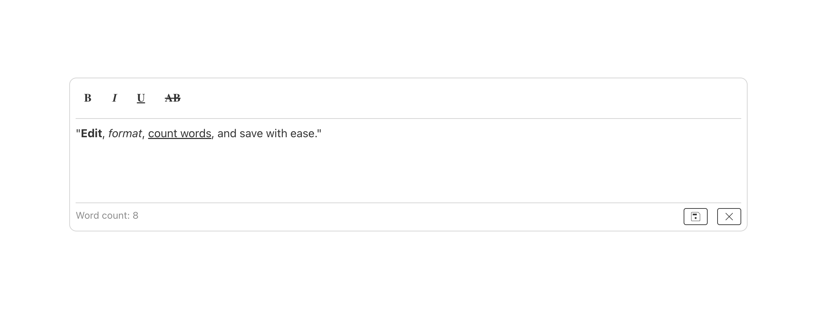

# WYSIWYG Editor

## About

This is a flexible **React WYSIWYG editor component**, crafted on top of **Draft.js**. It provides a foundation for rich text editing in your applications, designed with extensibility and developer control in mind.



## Table of contents

- [WYSIWYG Editor](#wysiwyg-editor)
  - [About](#about)
  - [Table of contents](#table-of-contents)
  - [Features](#features)
  - [Getting Started](#getting-started)
  - [Demo](#demo)
  - [Examples](#examples)
  - [Contributing](#contributing)
  - [Acknowledgments](#acknowledgments)
  - [License](#license)
  - [Show your support](#show-your-support)

<a name="features"></a>

## Features

* **Customizable Toolbar**: it includes a basic formatting toolbar with essential options like **bold, italic, underline, and strikethrough**. Crucially, this toolbar is engineered to be easily **extendable or completely replaceable**, allowing you to tailor the editing experience precisely to your needs.

* **Controlled & Uncontrolled Modes**: Seamlessly integrate the editor into your React application's state management with support for both **controlled and uncontrolled modes**. This flexibility gives you full command over how content updates are handled.

* **API Integration**: The component offers built-in functionality to **fetch initial content from a specified API endpoint** and **persist edited content back** after changes are made.

* **Word Count**: Enhance the editing experience with a handy **word count feature**, providing real-time feedback on content length.

* **Basic Customization**: Easily style the editor's appearance using a className prop for CSS classes and an optional style prop for inline styles, offering quick visual adjustments.

<a name="getting_started"></a>


## Getting Started 

To get start with WYSIWYG Editor, This guide will help you quickly set up and use it. It's a React component that relies on the Draft.js library for its core editing features.

1. Quick Start
To get a feel for the editor and explore the provided examples:
- **Clone the project**: Download the project files to your local machine.
- **Install dependencies**: Navigate to the project directory in your terminal and run `npm install`. This command installs all the necessary Node.js modules.
- **Run the development server**: After installation, execute npm dev to start a local server. You can then open your browser and test the examples provided in the **app.tsx** file.

2. Using it in Your Own Project
To integrate the WYSIWYG Editor into your existing project:
- **Copy the component**: Simply copy the wysiwyg-editor folder from the components directory into your project.
- **Integrate and use**: Refer to the examples provided in the project for guidance on how to use the component in your own application.

<a name="demo"></a>

## Demo

Here are the links to the live demo and the video demo of the Printify Studio:

- [Live Demo Link](https://maha-magdy.github.io/printify-studio/)
- Video Demo

https://github.com/Maha-Magdy/printify-studio/assets/62838415/2f4b7ea9-9823-482b-9c2a-65bf7b5fb5f3

<a name="props_reference"></a>
``` 
interface WysiwygEditorProps {
    /**
     * In controlled mode, the RawDraftContentState value to display.
     * When provided, the editor operates as a controlled component.
     */
    value?: RawDraftContentState;
    /**
     * Callback function triggered on content change, providing the updated RawDraftContentState.
     * Required for controlled mode.
     */
    callback?: (content: RawDraftContentState) => void;
    /**
     * Optional CSS class name for the editor container.
     */
    className?: string;
    /**
     * Optional inline CSS style for the editor container.
     */
    style?: React.CSSProperties;
    /**
     * API endpoint for content persistence (e.g., loading initial content, and save it after edit it).
     * This prop enables an internal mechanism for fetching/saving content.
     */
    contentApi?: string;
    /**
     * Callback function executed upon successful content save via `contentApi`.
     */
    onSaveSuccess?: () => void;
    /**
     * Callback function executed upon content save error via `contentApi`.
     * Provides the error object.
     */
    onSaveError?: (error: unknown) => void;
    /**
     * [CONCEPTUAL] An array of strings defining which toolbar options should be displayed.
     * Example: `['bold', 'italic', 'ul', 'ol', 'link']`.
     * You would need to implement the logic within the WysiwygEditor component to
     * render toolbar buttons based on this prop.
     */
    toolbarOptions?: string[];
}
``` 

<a name="examples"></a>

## Examples

For examples, see the **app.tsx** file.

<a name="contributing"></a>

## Contributing

Contributions, issues, and feature requests are welcome!

Feel free to check the [issues page](https://github.com/Maha-Magdy/wysiwyg-editor/issues).

<a name="acknowledgments"></a>

## Acknowledgments

- This WYSIWYG editor leverages the <a href="https://draftjs.org/">Draft.js</a> library.

<a name="license"></a>

## License

This project is [MIT](./LICENSE) licensed.

## Show your support

Give a ⭐️ if you like this project!
